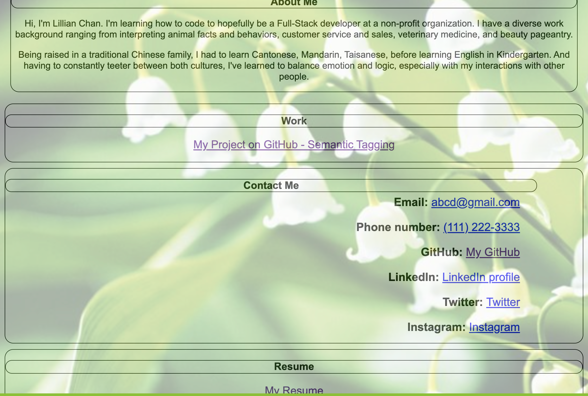

# personal-portfolio

# Project name
This is Lillian Chan's personal portfolio.

It contains several links and pictures with information about me and my work experiences. 

# Prerequisites
Before you begin, ensure you have met the following requirements:
* You have installed the latest version of Visual Studio Code. 
* You are using a Windows or Mac OS machine. OS version 10 or above.
* You have installed the lastest Google Chrome browser.

# Installing Portfolio application
To install my portfolio application, follow these steps:
macOS and Windows:
1. Open a new tab in Chrome
2. Then press Ctrl (Windows) or Cmd (Mac) + O. This will bring up the Open File menu. 
4. Find your HTML file and open it with Visual Studion Code.
5. On the left panel, find *index.html* file and right click on it.
6. When drop down menu appears, select *Open in Other Browser" to choose Chrome.
7. This application should appear in the Chrome browser for your perusal.

# Website Link
https://github.com/lill717/personal-portfolio.git